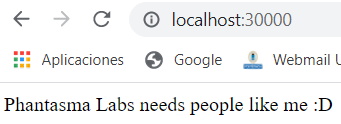

# MLOpsChallenge

## Task

Basic "Hello World" Python application, deployed on Docker and configured in a Kubernetes cluster that can be accessed via localhost

## Dockerizing the app
The file "Dockerfile" has the configuration to deploy a Python basic "Hello World" application using Flask library that can be accessed through localhost.

For deploying the app, first it is necessary to build the image by executing the following command in the directory where the Dockerfile is included:

```bash
docker build --tag python-docker .
```

I called my image "python-docker". Then, we need to run this image in the container, and we need to publish it into a port in the local network:

```bash
docker run --publish 5000:5000 python-docker
```

I have chosen port 5000 both inside and outside the container. With this configuration, the application would be accesible from http://localhost:5000 and it would return "Hello World!".

## Push app into Kubernetes cluster
In order to create the image of the Python app, it is needed to build the image from the Dockerfile again:
```bash
docker build --tag python-docker .
```

Again, it is called "python-docker". Then, for deploying the image into a Kubernetes cluster, I have created two files, "deployment-app.yaml" for creating the cluster that consists of just one replica, and "service-app.yaml", that allows to expose the application into the network to be accesible.

### Node of the application
The file "deployment-app.yaml" creates a Deployment of just one replica. This deployment is built with the image previously created "python-docker". In order to run the deployment and create the pod, it is need
ed to run the apply command:
```bash
kubectl apply -f deployment-app.yaml
```
The cluster is created in the default namespace. In a large environment, it would be better to create different namespaces for different implementations.

### Service of the application
The service allows the application to be accesible from the newwork. There are different types of services, in our case, since we want to access the application from localhost, the best type is the NodePort. This allows to access the application from an exposed port defined in the file.
The file "service-app.yaml" defines a NodePort service and associates it with the Deployment previously applied. It specifies to use TCP and port of the container 5000, and it exposes that to port 30000. Therefore, the application is going to be accesible from port 30000.

In order to deploy the service, it is needed to run:
```bash
kubectl apply -f service-app.yaml
```
After creating the service, the application can be accessed through http://localhost:30000 and it would return the following:

